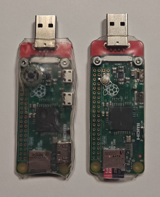

PolyDisk is a USB mass storage device that can emulate any USB disk or CD-ROM/DVD from a collection of .iso and .img files. It is ideal for booting computers from USB without having to carry or rewrite multiple USB thumbdrives.

# Features
- Emulates USB CD-ROM/DVD (.iso) and USB disk (.img, .raw)
- Configurable read-write or read-only images
- Configurable idVendor, idProduct and descriptor strings to impersonate real USB thumbrives or storage devices

# Supported boards

- Raspberry Pi Zero
- Raspberry Pi Zero W
- Raspberry Pi Zero 2 W

Here is the first and second versions I made with the [USB Stem from SparkFun](https://www.sparkfun.com/pi-zero-usb-stem.html). A push button soldered between GPIO 19 and ground is used to switch into selection mode. The board is wrapped with shrink tubing.



# Installation

- Build or download a [prebuilt image](https://github.com/doominator42/PolyDisk/releases/latest) for your board.
- Write the PolyDisk image to a microSD card with [Rufus](https://rufus.ie/) (Windows), `dd` or other disk imaging software. A high-end microSD (V30/U3 or better) is recommended.
- On first boot, it will create and format the second partition where you are going store your images. This process takes 5-10 seconds. It is safe to unplug when the LED turns completely off.
- Insert the microSD card in your computer and copy your .iso or .img files to the second partition.

# How to use

### Image selection

In selection mode, PolyDisk creates a temporary fake file system from the files on the microSD card and presents it to the host. This is only used as an interface to choose the wanted image. You can use any device with a file explorer that can read and write to a USB exFAT drive: Windows/Linux/Mac Desktop, Android phone/tablet, iPhone/iPad.
- Plug your PolyDisk into any capable host. The LED will do a heartbeat (2 quick flashes every second) when idle, press the button to go into selection mode.
- Copy the wanted image file to the root of the file system, eject the media and unplug when the LED is off.
- Some hosts might not send any signal when ejecting, in that case you can press the button after ejecting and unplug after the LED is off.
- Plug your PolyDisk into any host, the chosen image will be presented and the host will see it as if it was a normal USB drive.
- To choose another image, press the button to eject the current image and press again when the LED does a heartbeat.
- Holding the button for 2 seconds while being plugged in will boot directly into selection mode.

### Configuration

Image files ending with `.rw.img` or `.rw.raw` will be mounted as writable to the host. `.iso` files are always read-only.

Additional properties can be set in a `.ini` file with the same name as the image file (e.g. `some-image.iso.ini`).

|Property|Description
|-|-|
|`usbids`|USB `idVendor`, `idProduct` and `bcdDevice`, in the format `1a2b:3c4d:0100` or `1a2b:3c4d`|
|`strings_LANGCODE_manufacturer`|USB Manufacturer name|
|`strings_LANGCODE_product`|USB Product name|
|`strings_LANGCODE_serialnumber`|USB Serial number|
|`inquiry_vendor`|UASP inquiry vendor name (max 8 chars)|
|`inquiry_product`|UASP inquiry product name (max 16 chars)|
|`inquiry_revision`|UASP inquiry revision (max 4 chars)|

#### Example configuration
```conf
usbids=090c:1000:1100
strings_0x409_manufacturer=Samsung
strings_0x409_product=Flash Drive
strings_0x409_serialnumber=0123456789
```

# Limitations

- The microSD interface of the Raspberry Pi Zero is limited to around 22 MB/s of transfer rate.
- It takes about 2.1 seconds to boot and present the image to the host, which might be too late to be detected by the BIOS of some computers. In that case, the board must be powered externally or the computer must have USB ports powered when off.

# How to build

### Dependencies
- [linux build dependencies](https://www.raspberrypi.com/documentation/computers/linux_kernel.html)
- [apk.static](https://wiki.alpinelinux.org/wiki/Bootstrapping_Alpine_Linux)
- curl
- sfdisk
- mtools
- dosfstools
- exfatprogs

### Clone the repository
```shell
git clone --recurse-submodules https://github.com/doominator42/PolyDisk.git
cd PolyDisk
```

### Apply kernel patches
```shell
sh patch-linux.sh
```

### Build linux ([cross-compilation](https://www.raspberrypi.com/documentation/computers/linux_kernel.html#cross-compile-the-kernel) on Debian)
```shell
# For Raspberry Pi Zero / Zero W
cd linux
make KERNEL=kernel ARCH=arm CROSS_COMPILE=arm-linux-gnueabihf- bcmrpi_cd_defconfig
make KERNEL=kernel ARCH=arm CROSS_COMPILE=arm-linux-gnueabihf- -j$(nproc) zImage dtbs
cd ..

# For Raspberry Pi Zero 2 W
cd linux
make KERNEL=kernel7 ARCH=arm CROSS_COMPILE=arm-linux-gnueabihf- bcm2709_cd_defconfig
make KERNEL=kernel7 ARCH=arm CROSS_COMPILE=arm-linux-gnueabihf- -j$(nproc) zImage dtbs
cd ..
```

### Create the SD card image

Note: this will automatically download RPI firmware blobs, busybox binaries and Alpine Linux APKs to be included in the image, see `write-bootfs.sh` for details.
```shell
# BOARD can be either rpi-zero, rpi-zero-w or rpi-zero-2-w
APK_TOOL=/path/to/apk.static sh create-sdcard-img.sh BOARD build/PolyDisk.img
```

# Development build

- Build the kernel with TTY console support by using `*_tty_defconfig` (e.g. `bcmrpi_cd_tty_defconfig`).
- Set the environment variable `TTY_DEBUG` to enable the serial console (UART0 on GPIO 14,15).

```shell
TTY_DEBUG=1 sh create-sdcard-img.sh BOARD build/PolyDisk.img
```
Note: The UART0 does not work on the Wireless versions. Probably caused by how device-trees are loaded. I have yet to find a solution.

Once the image is written to the SD card, you can use the following to update the binaries without reformatting the SD card.

```shell
# MOUNTPOINT is the path where the first partition (bootfs) of the SD card is mounted
TTY_DEBUG=1 sh write-bootfs.sh BOARD MOUNTPOINT
```
